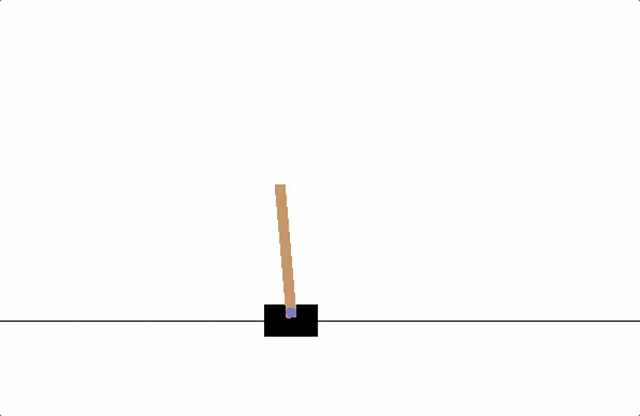

# DQN-CartPole
This project implements a Deep Q-Network for the VCartPole environment with some slight modifications to the neural network specifically the layers and loss function used.

Main goal: Try to balance the pole as long as possible.

  

# DQN Algorithm

The DQN (Deep Q-Network) algorithm is a reinforcement learning method designed to train an agent to maximize cumulative rewards in a given environment. The key concepts include:

- **Objective**: Maximize the discounted cumulative reward:

  $R_{t_0} = \sum_{t=t_0}^\infty \gamma^{t-t_0} r_t$
  where $\gamma$ is the discount factor $0 < \gamma < 1$ that balances the importance of immediate and future rewards.

- **Q-Learning**: The algorithm uses a function $Q^*(s, a)$ to estimate the expected return of taking action $s$ in state $s$. The optimal policy is derived as:

  $\pi^*(s) = \arg\max_a Q^*(s, a)$

- **Bellman Equation**: The $Q$-function satisfies the Bellman equation:

  $Q_\pi(s, a) = r + \gamma Q_\pi(s', \pi(s'))$
- **Temporal Difference Error**: The difference between the predicted $Q$-value and the target $Q$-value is:

  $\delta = Q(s, a) - \left(r + \gamma \max_{a'} Q(s', a')\right)$

- **Loss Function**: The Huber loss is used to minimize the temporal difference error, making the training robust to outliers:

  $L(\delta) = \begin{cases} 
  \frac{1}{2} \delta^2 & \text{if } |\delta| \leq 1, \\
  |\delta| - \frac{1}{2} & \text{otherwise.}
  \end{cases}$

- **Q-Network**: A feed-forward neural network is used to approximate $Q(s, a)$. It predicts the expected return for each action (e.g., left or right) given the current state.

This algorithm enables the agent to learn an optimal policy for decision-making in complex environments.

# References
* Pytorch
https://docs.pytorch.org/tutorials/intermediate/reinforcement_q_learning.html
* OpenAI Gym
https://gymnasium.farama.org/environments/classic_control/cart_pole/